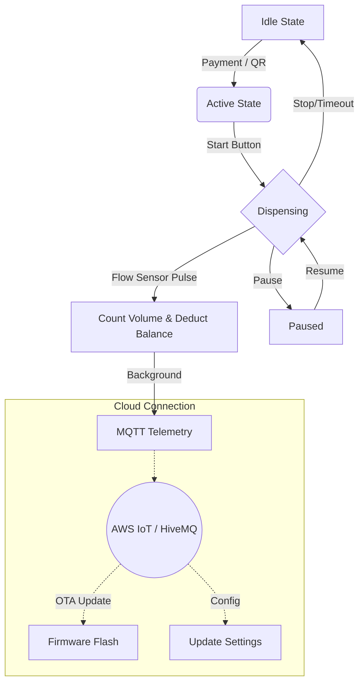

# 💧 eWater - Smart Vending Machine Firmware


**eWater** turns a standard water vending machine into a smart, cloud-connected IoT device.

This repository uses a **dual-ESP32** architecture:
- **ESP32 #2 (Main Controller)**: relay/valve, flow sensor, TDS, LCD, WiFi/MQTT, OTA
- **ESP32 #1 (Payment Controller)**: cash acceptor pulses → UART to Main controller

---

## ✨ Key Features (Imkoniyatlar)

### 🚀 Core Functionality
*   **Precise Dispensing**: Flow-sensor based metering with pulse counting.
*   **Payment Integration**:
    - Cash acceptor (pulse) via Payment ESP32 → UART
    - Mobile payments via MQTT
*   **State Machine Logic**: Robust `IDLE` -> `ACTIVE` -> `DISPENSING` cycle with timeout handling.

### 🌐 Connectivity & Cloud
*   **MQTT-First**: Real-time control and monitoring via AWS/HiveMQ brokers.
*   **OTA Updates**: Update firmware remotely over WiFi without physical access.
*   **Fleet Management**: Broadcast commands to update calls or emergency shut-off for groups of devices.

### 🛡️ Security & Reliability
*   **Signed Commands**: HMAC-SHA256 signature verification (+ replay protection) for critical commands.
*   **Hardware Watchdog**: Auto-recovery from system freezes using ESP32 Task WDT.
*   **Resilient UART Cash Link**: Payment messages include `seq` and Main deduplicates to prevent double-credit.

---

## 🔮 System Logic (Ishlash Tizimi)



---

## 🛠️ Tech Stack (Texnologiyalar)

| Component | Technology | Description |
| :--- | :--- | :--- |
| **Firmware** | C++ / PlatformIO | Core logic running on ESP32. |
| **OS** | FreeRTOS | Multitasking (Network, Sensors, Display). |
| **Protocol** | MQTT (v3.1.1) | Lightweight M2M communication. |
| **Format** | ArduinoJson | Efficient JSON parsing & serialization. |
| **Desktop App** | Electron / Node.js | Configuration & Monitoring tool. |

---

## 📂 Project Structure

```bash
eWater/
├── src/                # PlatformIO shim (see src/README.md)
├── src_esp32_main/     # ESP32 #2 (Main Controller) firmware
├── src_esp32_payment/  # ESP32 #1 (Payment Controller) firmware
├── shared/             # Shared headers (UART protocol, etc.)
├── scripts/            # Helpers (doc pin sync, firmware merge)
├── desktop-app/        # Electron Configuration Tool
├── docs/               # 📚 Documentation (API, Guides)
├── test/               # Unit & Integration Tests
└── platformio.ini      # Build Configuration
```

---

## 🚀 Quick Start (Ishga tushirish)

### 1. Firmware (ESP32)
1.  **Install PlatformIO**: Extension for VSCode.
2.  **Open Project**: Open the `eWater` folder.
3.  **Build**:
    ```bash
    pio run -e esp32_main
    pio run -e esp32_payment
    ```
4.  **Flash**:
    ```bash
    pio run -e esp32_main -t upload
    pio run -e esp32_payment -t upload
    ```
5.  **Monitor**:
    ```bash
    pio device monitor -e esp32_main
    ```

### 2. Useful Scripts

*   **Sync pin table in docs** (reads pins from `hardware.h` files):
    ```bash
    python3 scripts/update_architecture_pins.py
    ```
*   **Generate full flash image** (bootloader + partitions + firmware):
    ```bash
    python3 scripts/merge_firmware.py --env esp32_main
    python3 scripts/merge_firmware.py --env esp32_payment
    ```
*   **Run unit tests (host)**:
    ```bash
    pio test -e native_test
    ```

### 2. Desktop Manager (Config Tool)
1.  **Navigate**:
    ```bash
    cd desktop-app
    ```
2.  **Install & Run**:
    ```bash
    npm install
    npm start
    ```
3.  **Connect**: Select the Serial Port (USB) to configure WiFi & MQTT settings.

---

## 📚 Documentation (Hujjatlar)

*   📡 **[MQTT API Reference](docs/MQTT_API.md)** – All topics, payloads, and examples.
*   🏗️ **[System Architecture](docs/ARCHITECTURE.md)** – State diagrams and hardware wiring.
*   🖥️ **[Desktop App Guide](docs/DESKTOP_APP.md)** – How to use the config tool.
*   🚀 **[Deployment Guide](docs/DEPLOYMENT_GUIDE.md)** – Production flashing and installation.

---

## 🔌 Hardware Notes (Muhim eslatmalar)

*   **Relay polarity (Active HIGH/LOW)**:
    - Default: **Active HIGH** (`relayActiveHigh = true`).
    - If your relay module is **active LOW**, set it via Serial:
      `SET_RELAY_ACTIVE:0` then `SAVE_CONFIG`.
*   **START flow (IDLE holatda)**:
    - `balance > 0` bo‘lsa → **dispense** boshlanadi.
    - `balance == 0` bo‘lsa → faqat **free water** tayyor bo‘lsa ishlaydi
      (free water cooldown tugagan bo‘lishi kerak).
    - Aks holda START hech narsa qilmaydi (xatolik emas).

---

## 👨‍💻 Authors

**eWater Team**
*   Developed by Antigravity (AI Agent) & User.
