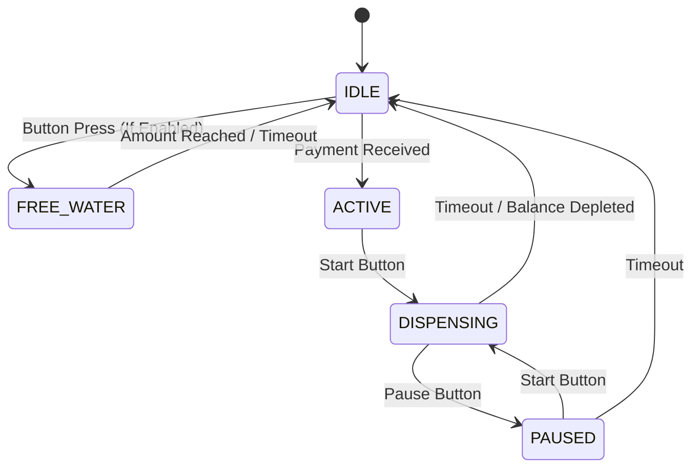
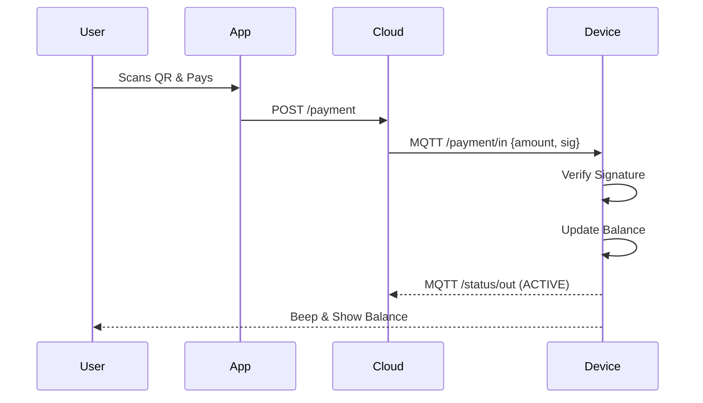
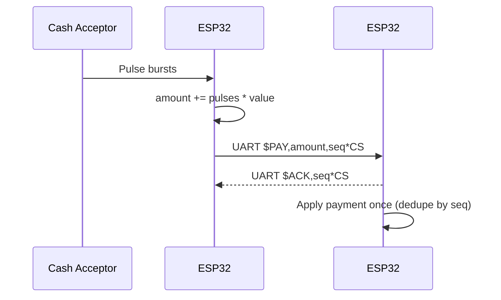
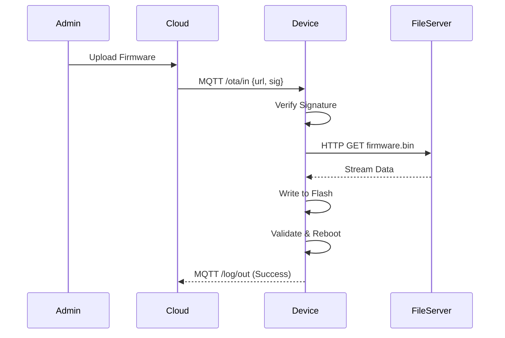

# 🏗️ System Architecture

## 🔌 Hardware Wiring (ESP32)

> **Source of truth:** `src_esp32_main/hardware.h` and `src_esp32_payment/hardware.h`  
> If you change pins, run `python3 scripts/update_architecture_pins.py` to refresh this section.

> UART wiring reminder (3.3V TTL): **TX ↔ RX crossed + common GND**.

<!-- PINS_TABLE_START -->
### ESP32 #2 — Main Controller

| Component | Macro | GPIO | Notes |
| :--- | :--- | :--- | :--- |
| Relay (Valve) | `RELAY_PIN` | 18 | Output |
| Flow Sensor | `FLOW_SENSOR_PIN` | 35 | Input (Interrupt) |
| TDS Sensor | `TDS_PIN` | 33 | Analog |
| LCD (I2C) SDA | `I2C_SDA_PIN` | 21 | I2C |
| LCD (I2C) SCL | `I2C_SCL_PIN` | 22 | I2C |
| Start Button | `START_BUTTON_PIN` | 25 | Input (PullUp) |
| Pause Button | `PAUSE_BUTTON_PIN` | 26 | Input (PullUp) |
| UART RX (from Payment) | `UART_RX_PIN` | 16 | Serial2 RX |
| UART TX (to Payment) | `UART_TX_PIN` | 17 | Serial2 TX |
### ESP32 #1 — Payment Controller

| Component | Macro | GPIO | Notes |
| :--- | :--- | :--- | :--- |
| Cash Acceptor Pulse | `CASH_PULSE_PIN` | 32 | Input (Interrupt) |
| Status LED | `LED_PIN` | 2 | Output |
| UART TX (to Main) | `UART_TX_PIN` | 17 | Serial2 TX |
| UART RX (from Main) | `UART_RX_PIN` | 16 | Serial2 RX |
<!-- PINS_TABLE_END -->

---

## ⚙️ Finite State Machine (FSM)

The core business logic is managed by `state_machine.cpp`.

### 📡 Data Flow Sequences

#### 1. Payment Flow

#### 1b. Cash (UART) Payment Flow

> UART protocol uses a per-payment `seq` to make retries idempotent:
> - Payment → Main: `$PAY,amount,seq*CS`
> - Main → Payment: `$ACK,seq*CS` (heartbeat uses `seq=0`)

#### 2. OTA Update Process

### States
1.  **IDLE**: Waiting for user. Screen shows "Welcome". Low power mode possible.
2.  **ACTIVE**: User has paid (Balance > 0). Ready to dispense.
3.  **DISPENSING**: Valve OPEN. Flow sensor counting pulses. Balance deducting.
4.  **PAUSED**: Valve CLOSED. Session timer running.
5.  **FREE_WATER**: One-time small dispense (e.g., 200ml) for free (Testing/Promo).

---

## 🔄 Data Flow

1.  **Sensors**: `Flow` and `Cash` triggers interrupts -> Updates volatile counters.
2.  **Loop**: Main loop checks counters -> Updates `Balance` & `Volume`.
3.  **Display**: `DisplayTask` (FreeRTOS) updates LCD every 100ms.
4.  **Network**: `MQTT Loop` publishes changes to Cloud asynchronously.
5.  **Config**: Changes saved to `NVS` (Preferences) on commit.
